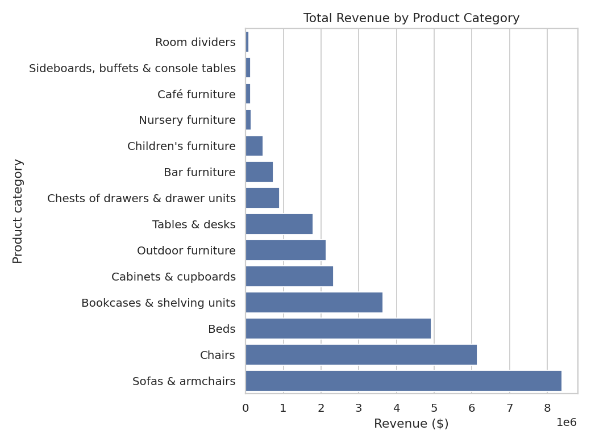
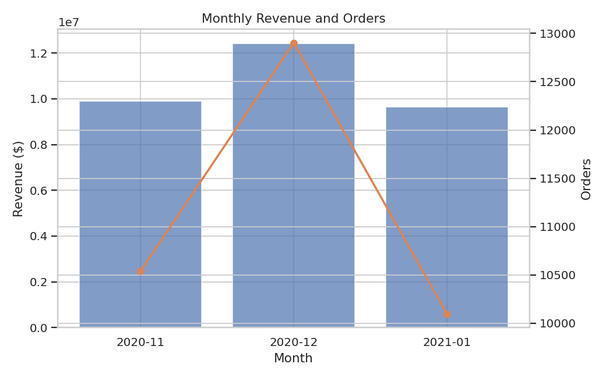
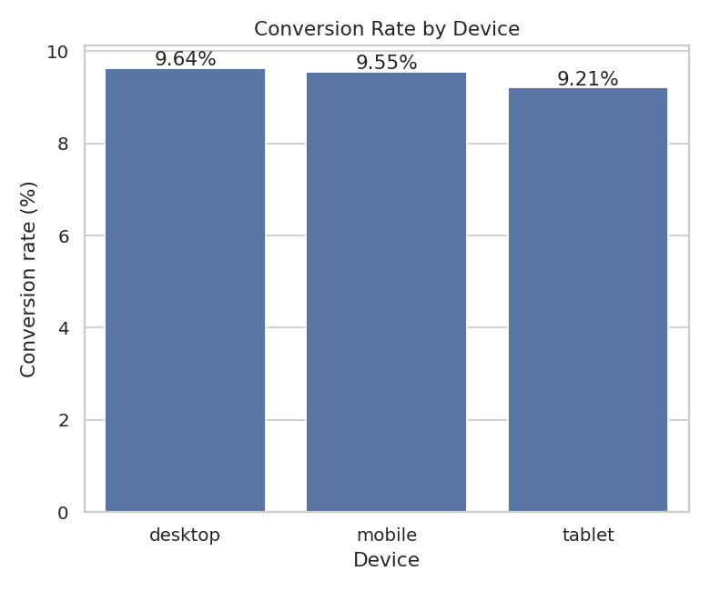
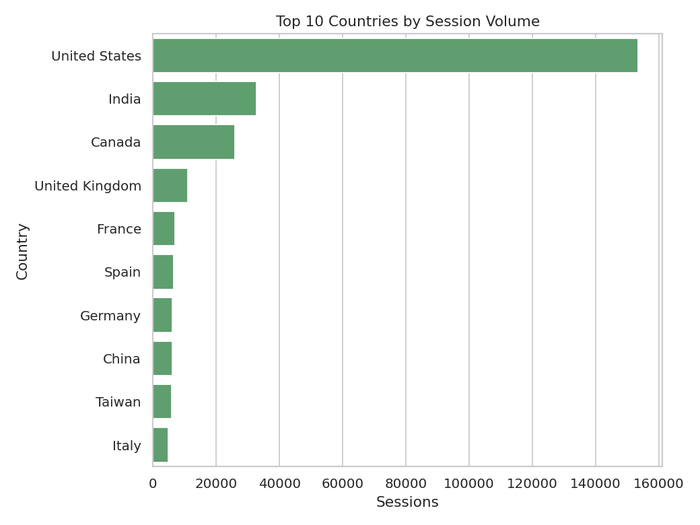

# 🛋️ Furniture Store Sales Analysis

A data science project analyzing ~350K website sessions from an online furniture store to uncover
conversion drivers, revenue trends, and audience behavior, and to test whether session-level
attributes can predict purchase behavior.

## 🔗 Live deliverables

- **Interactive dashboard (Tableau Public):** https://public.tableau.com/app/profile/dmytro.ruzhytskyi/viz/projectDashboard_17799941828760/Dashboard1
- **Original exploratory notebook (Google Colab):** https://colab.research.google.com/drive/1zs6w8GdSUzN3p40i8ylBAEnL2RxbYbnU?usp=sharing
- **Full analysis notebook (this repo):** [`notebooks/furniture_sales_analysis.ipynb`](notebooks/furniture_sales_analysis.ipynb)

## 📊 Project overview

The dataset contains session-level web analytics (device, browser, traffic source, geography, account
status) for an online furniture store between **November 2020 and January 2021**. Roughly 90% of
sessions are browsing-only; the remainder resulted in a purchase, with product and price details
attached.

**Business questions explored:**
1. What is the overall conversion rate and revenue, and how do they trend month over month?
2. Which product categories drive the most revenue?
3. Does conversion vary by device, traffic channel, or country?
4. Do registered / subscribed users convert better than guests?
5. Can we predict whether a session will convert using only acquisition-level attributes (device,
   browser, traffic source, geography, account status)?

## 🔑 Key findings

| Metric | Value |
|---|---|
| Sessions analyzed | 349,545 |
| Overall conversion rate | ~9.6% |
| Total revenue | ~$32M |
| Average order value | ~$953 |
| Countries represented | 108 |
| Product categories | 14 |
| Date range | Nov 2020 – Jan 2021 |

- **Sofas & armchairs, Chairs, and Beds** generate the majority of revenue despite not being the
  highest-volume categories — price per unit, not order count, drives revenue concentration.
- Conversion rate is **remarkably stable across device, traffic channel, and country** (all cluster
  tightly around 9–10%) — no single acquisition dimension is a strong lever on its own.
- **Registered and subscribed users convert modestly better** than guests / non-subscribers.
- A logistic regression classifier trained purely on acquisition-level attributes (device, browser,
  traffic channel, geography, account status) scores **~0.50 ROC-AUC** — i.e., no real predictive
  power. This is a useful negative finding: it suggests conversion is driven by **on-site behavior**
  (product engagement, price sensitivity, session depth) rather than by who the visitor is or how
  they arrived — a good direction for future data collection.
- **January 2021 shows a mild post-holiday dip** in order volume and conversion rate versus Nov/Dec
  2020.

See the notebook for the full breakdown, charts, and the modeling exercise, or the
[Tableau dashboard](https://public.tableau.com/app/profile/dmytro.ruzhytskyi/viz/projectDashboard_17799941828760/Dashboard1)
for an interactive view.

## 📁 Project structure

```
Furniture_store_sales_analysys/
├── data/
│   ├── raw/                    # Original dataset
│   │   └── final_dataset.csv
│   └── processed/              # Cleaned dataset (generated by src/data_cleaning.py)
│       └── cleaned_sessions.csv
├── notebooks/
│   └── furniture_sales_analysis.ipynb   # Full EDA + modeling walkthrough
├── src/
│   ├── data_cleaning.py        # Loads, cleans, and feature-engineers the raw data
│   └── visualize.py            # Generates the charts used in the notebook/README
├── visuals/                     # Exported PNG charts
├── requirements.txt
└── README.md
```

## 🧰 Tech stack

- **Python 3.10+**
- `pandas`, `numpy` — data wrangling
- `matplotlib`, `seaborn` — visualization
- `scikit-learn` — predictive modeling (logistic regression baseline)
- `jupyter` — analysis notebook

## ▶️ How to run

```bash
# 1. Clone the repo
git clone https://github.com/<your-username>/Furniture_store_sales_analysys.git
cd Furniture_store_sales_analysys

# 2. Set up environment
python -m venv venv
source venv/bin/activate   # Windows: venv\Scripts\activate
pip install -r requirements.txt

# 3. Clean the raw data
python src/data_cleaning.py --input data/raw/final_dataset.csv --output data/processed/cleaned_sessions.csv

# 4. Generate the charts
python src/visualize.py --input data/processed/cleaned_sessions.csv --outdir visuals

# 5. Explore the full analysis
jupyter notebook notebooks/furniture_sales_analysis.ipynb
```

## 📈 Example visuals

| | |
|---|---|
|  |  |
|  |  |

## 📄 Data source

Session-level web analytics export (Google-Analytics-style schema) for an online furniture store,
Nov 2020 – Jan 2021. Fields include session ID, geography, device/browser, traffic source/channel,
account status (registered / subscribed / email verified), and — for converted sessions — product
category, product name, price, and description.

## 👤 Author

**Dmytro Ruzhytskyi**
Part of a broader QA/data portfolio — see other projects on this GitHub profile.
